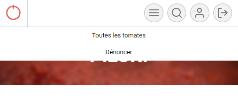
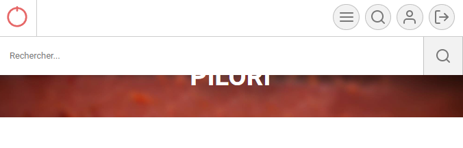
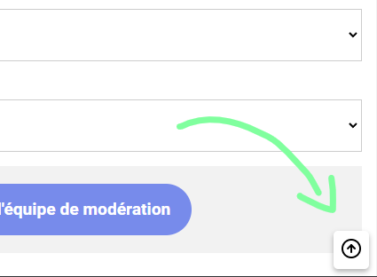
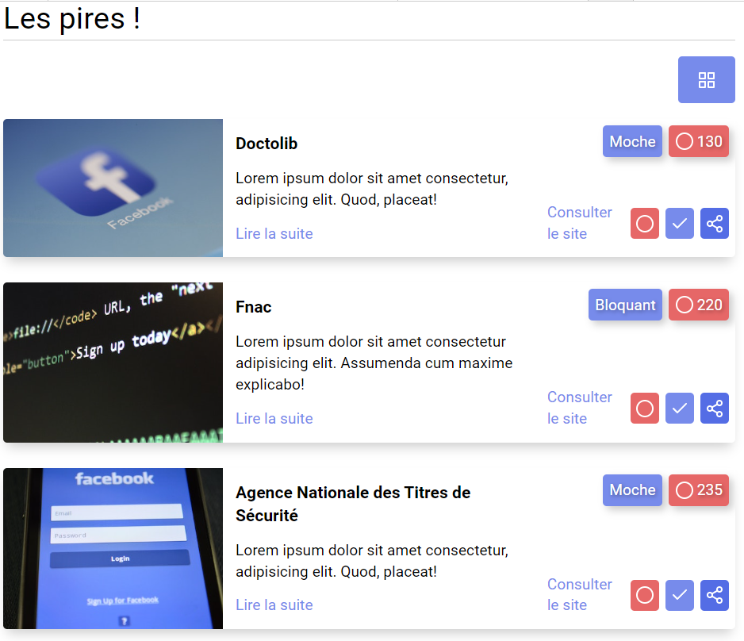

# Pilori : intéraction

En repartant de l'intégration de Pilori, on va ajouter quelques interactions

## Menu burger

Sur les très petits écrans, on va masquer le menu et ses 2 items `Toutes les tomates` et `Dénoncer` (en CSS)

De plus, toujours uniquement sur petits écran on va ajouter une [icone de menu](https://feathericons.com/?query=menu) en plus des 3 icones en haut à droite (en HTML). 

A chaque clic sur cette icône, il faut afficher ou masquer le menu (en JS). Adapte les styles du menu pour que soit élégant (en CSS, par exemple en position fixe quand il est visible).

  
Aperçu fermé

  
Aperçu ouvert

## Recherche

Sur les très petits écran le formulaire de recherche est caché. Il faudrait qu'il devienne visible quand on clique sur la loupe puis se referme si on clique de nouveau.  
Un peu dans le même principe que l'étape précédente finalement.

  
Aperçu fermé

  
Aperçu ouvert

## Remonter en haut de page

On aimerait qu'un bouton avec une flèche vers le haut permette de remonter en haut de page de manière fluide. De plus on veut que ce bouton ne soit pas visible par défaut.  
Il doit apparaître seulement quand on a défilé la page. Ce bouton doit être présent de manière fixe en bas à droite de la fenêtre

  
Aperçu

## Affichage en grille ou en liste

Sur grand écran on affiche une grille de 3 colonnes. On voudrait que l'utilisateur puisse choisir un affichage sous forme de liste.  
Un peu comme sur le site de la fnac sur lequel on peut passer d'un affichage en [mosaïque](https://www.fnac.com/Salon-de-jardin/Mobilier-de-jardin/nsh531573/w-4?SDM=mosaic) à un affichage en [liste](https://www.fnac.com/Salon-de-jardin/Mobilier-de-jardin/nsh531573/w-4?SDM=list)

  
Mode grille

  
Mode liste

